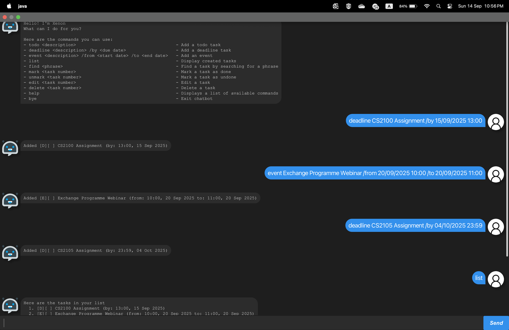

# Xenon User Guide



## Introduction
Xenon is a desktop app for managing your tasks, optimized for use via a Command Line Interface (CLI) while still having the benefits of a Graphical User Interface (GUI). If you can type fast, Xenon can get your task management tasks done faster than traditional GUI apps.

## Quick start
1. Ensure you have Java `17` or above installed in your Computer. <br>**Mac** Users: Ensure you have the precise JDK version prescribed here
2. Download the latest `.jar` file from here.
3. Copy the file to the folder you want to use as the _home folder_ for your Xenon.
4. Open a command terminal `cd` into the folder you put the jar file in, and type `java -jar xenon.jar` to run the application. <br> Alternative: Double-click the jar file to run the application.
5. A GUI similar to the one above should appear in a few seconds.

## Features
Notes about the command format:
* dates should be specified in the following format: `dd/MM/yyyy HH:mm`
* commands are case-sensitive e.g., typing Help instead of `help` will not work.


### Viewing help : `help`
Shows a message displaying all commands available and their usages. <br>

Format: `help`
<br>
<br>
### Adding a task
There are three types of tasks that can be added:
* Todo Task
* Deadline Task
* Event Task

#### Adding a Todo Task
Adds a task Todo task to Xenon. <br>

Format: `todo <task description>>` <br>
Examples:
* `todo return book`
* `todo write report`

#### Adding a Deadline Task
Adds a task Deadline task to Xenon. <br>

Format: `deadline <task description>> /by <deadline>` <br>

Examples:
* `deadline assignment 1 /by 09/09/2025 09:30`
* `deadline report 2 /by 18/09/2025 09:30`

#### Adding an Event
Adds an Event to Xenon. <br>

Format: `event <event description> /from <start date> /to <end date>` <br>
Examples:
* `event meeting 1 /from 09/09/2025 09:30 /to 18/09/2025 18:30`
* `event camp /from 18/09/2025 09:30 /to 25/09/2025 18:30`
<br>
<br>
### Listing all tasks: `list`
Lists all tasks in Xenon. <br>

Format: `list`
<br>
<br>
### Deleting a task: `delete`
Deletes the specified task from Xenon. <br>

Format: `delete <task number>`
* The task number refers to the task number shown in the displayed task list.
* The task number must be a positive integer.
Examples:
* `delete 1`
<br>
<br>
### Editing a task: `edit`
Edits the specified task in Xenon. <br>

Format: `edit <task number>`
```
Tip: The task to be edited will be prepopulated into the text field for ease of editing. Make necessary changes and press enter to update task.
```
Examples:
* `edit 1`
<br>
<br>
### Marking a task as done: `mark`
Marks the specified task as done in Xenon. <br>

Format: `done <task number>`
* The task number refers to the task number shown in the displayed task list.
* The task number must be a positive integer.
Examples:
* `mark 1`
<br>
<br>
### Marking a task as undone: `unmark`
Marks the specified task as undone in Xenon. <br>

Format: `undone <task number>`
* The task number refers to the task number shown in the displayed task list.
* The task number must be a positive integer.
Examples:
* `unmark 1`
<br>
<br>
### Finding tasks by keywords `find`
Finds all tasks containing any of the given keywords. <br>

Format: `find <keyword>`
* The search is case-sensitive.
* Only the task description is searched.
* The keyword can be a phrase (e.g. `assignment report`).

Examples:
* `find assignment`
* `find report`
* `find assignment report`
<br>
<br>
### Exiting the program: `bye`
Exits the program. <br>
Format: `bye`
<br>
<br>
## Command summary

| Command           |                                                    Format and Examples                                                     | 
|:------------------|:--------------------------------------------------------------------------------------------------------------------------:|
| Add Todo task     |                                     `todo <description>` <br/> e.g. `todo return book`                                     |
| Add Deadline task |                `deadline <description> /by <deadline>`<br/> e.g. `deadline assignment /by 28/09/2025 09:30`                |
| Add Event         | `event <description> /from <start date> /to <end date>`<br/> e.g. `event camp /from 28/09/2025 09:30 /to 30/09/2025 09:30` | 
| List              |                                                           `list`                                                           |
| Delete            |                                        `delete <task number>`<br/> e.g. `delete 1`                                         |
| Edit              |                                          `edit <task number>`<br/> e.g. `edit 1`                                           |
| Mark as done      |                                          `mark <task number>`<br/> e.g. `mark 1`                                           |
| Unmark            |                                        `unmark <task number>`<br/> e.g. `unmark 1`                                         |
| Find              |                                        `find <keywords>`<br/>e.g. `find assignment`                                        |
| Help              |                                                           `help`                                                           |
| Exit              |                                                           `bye`                                                            |

